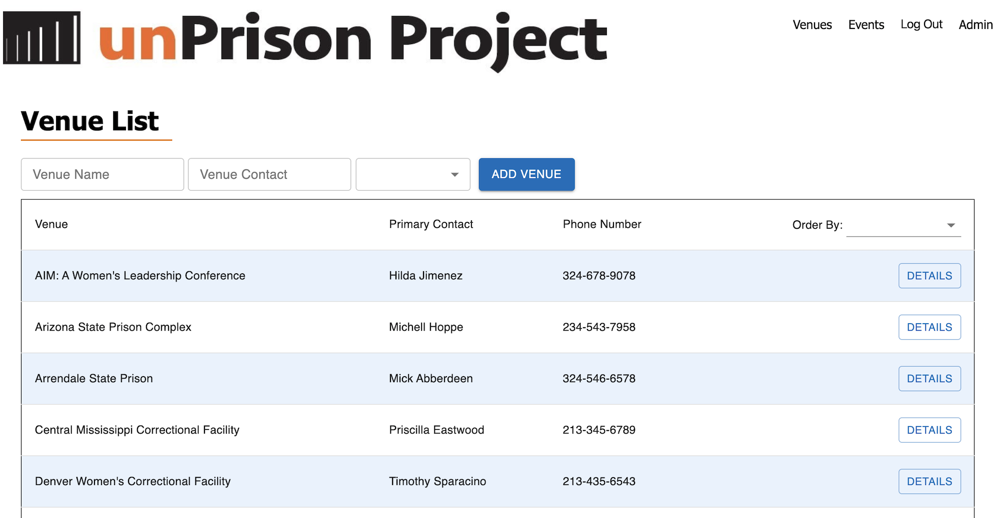
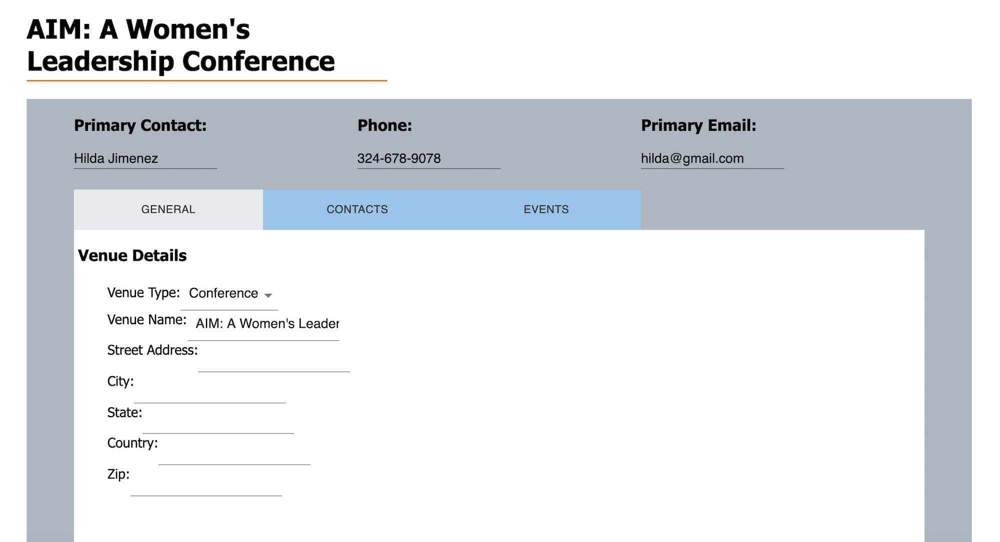

# unPrison Project

## [Demo] <insert url here>

## Description
Duration: Two Weeks

unPrison Project staff speak and present at prisons across the U.S teaching life skills, cultivating critical thinking, creating post-prison life plans, and helping incarcerated women stay connected with their families. Staff track engagements and data collection through Word documents, emails, and paper notebooks.

This web application is an administrative internal portal to allow staff to record, reference, and edit/add data quickly from one source from anywhere they have a wi-fi signal.

## Screen Shot

## Prerequisites
Before you get started, make sure you have the following software installed on your computer:

[Node.js](https://nodejs.org/en/)
[PostgreSQL](https://www.postgresql.org/)

## Create database and table

## Installation
1. Create a database named `unprison`
2. Use the queries in `database.sql` to set up the tables.
3. From the base directory in your terminal run `npm install` to grab the necessary dependencies. This may take some time.
4. Start postgres if not running already by using brew services start postgresql
5. Run `npm run server`
6. In another terminal instance run `npm run client`, the site will load in your default browser. Follow the prompts in your terminal if it cannot determine the default.
7. Navigate to localhost:3000

If you would like to name your database something else, you will need to change `unprison` to the name of your new database name in `server/modules/pool.js`

## Usage
- After users have logged in, they are presented with the Venues List page.
    - An admin can create additional users or delete users. Only the admin can do this and has an additional "admin" link in their navigation bar.
- A navigation bar is displayed at the top of the page. It includes other links to other pages titled `Venues`, `Events`, `Log Out`, and `Admin`.
- Venues can be added and will display in a list.
    - A Venue, once created, can be clicked to see more details about it. Information on the details page can be added and edited by a logged in user.
- On the Events page, a user can create a new event by selecting a venue from the dropdown menu, which is populated with venues created from the `Venues` page.
    - Note: An event can only be created for a venue that already exists.
    - An event, once created, can be clicked to see more details about it. Information on the events details page can be added and edited by a logged in user.

## Built With

- React.js
- Redux
- Redux Saga
- Express
- PostgreSQL
- Passport
- Moment
- Material UI
- Javascript
- HTML
- CSS

## Authors
- Chris Ferber
- Luke Schleder
- Sharifa Simon
- Evan Tilton

## Acknowledgments

- We would like to thank Deborah Jiang-Stein for sharing her mission with us and the opportunity to contribute to the amazing work that the unPrison Project is doing to change lives.